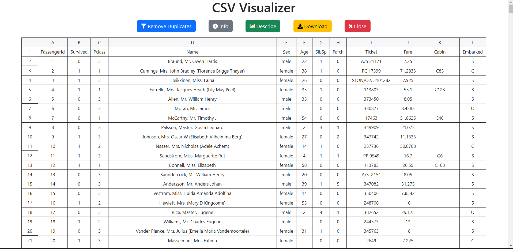

# CSV Visualizer



## Descripción

**CSV Visualizer** es una aplicación web simple y eficiente que permite a los usuarios cargar, visualizar y manipular archivos CSV de manera interactiva. Utiliza [Flask](https://flask.palletsprojects.com/) como framework backend, [Pandas](https://pandas.pydata.org/) para el analisis de datos y [Handsontable](https://handsontable.com/) para renderizar tablas dinámicas en el frontend.

## Uso
Subir un archivo CSV:

Ve a la página principal y selecciona un archivo CSV desde tu dispositivo.
Haz clic en "Upload" para cargar el archivo.
Visualizar los datos:

Una vez cargado, el archivo se mostrará en una tabla interactiva.
Realizar operaciones:

Usa los botones para eliminar duplicados, obtener información o descargar el archivo procesado.

Cerrar sesión:
Haz clic en "Close" para eliminar el archivo cargado y reiniciar la sesión.

## Características

- **Cargar Archivos CSV**: Permite a los usuarios cargar archivos CSV desde su dispositivo.
- **Visualización Interactiva**: Muestra los datos del archivo CSV en una tabla interactiva utilizando Handsontable.
- **Operaciones en los Datos**:
  - Eliminar duplicados.
  - Mostrar información básica del archivo.
  - Describir estadísticas de los datos.
  - Descargar el archivo procesado.
## Tecnologías Utilizadas

- **Backend**: Flask
- **Frontend**: HTML, CSS, Bootstrap, Handsontable
- **Librerías Adicionales**:
  - Font Awesome (para íconos)
  - Python `csv` (para manejo de archivos CSV)
  - `werkzeug` (para manejo seguro de archivos)

## Instalación

Sigue estos pasos para configurar el proyecto en tu máquina local:

- Clona este repositorio:
   ```bash
   git clone https://github.com/tu-usuario/csv-visualizer.git
   cd csv-visualizer
   ```

- levantar el proyecto
    ```bash
    py wsgi.py
    ```
